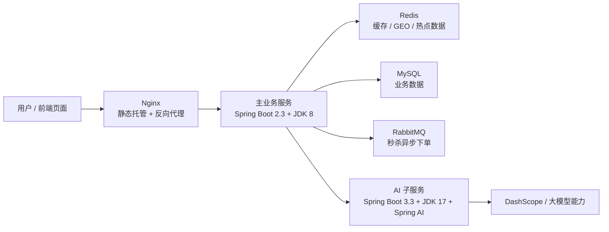

# 逸云点评助手

`SPRING BOOT`        

`SPRING AI`

`MYSQL`

`REDIS`

`RABBITMQ`

---

## 项目简介

逸云点评助手是一个springboot开发的前后端分离项目，使用了redis集群、tomcat集群、MySQL集群、RabbitMQ提高服务性能。类似于大众点评，实现了短信登录、商户查询缓存、优惠卷秒杀、附近的商户、UV统计、用户签到、好友关注、达人探店八个部分形成了闭环。其中重点使用了分布式锁实现了一人一单功能，使用RabbitMQ实现异步下单功能。

相比于其他点评项目，本项目还使用SpringAI接入大模型，用SideCar架构把店铺总结、智能推荐与评论风控三类大模型能力接入业务链路。

---

## 项目亮点

<table>
  <tr>
    <td width="50%">
      <strong>AI 能力独立部署</strong><br/>
      AI 逻辑拆为 Sidecar 服务，避免直接改动主业务基础框架。
    </td>
    <td width="50%">
      <strong>兼容旧底座</strong><br/>
      主项目继续使用 Spring Boot 2.3 + JDK 8，稳定优先。
    </td>
  </tr>
  <tr>
    <td width="50%">
      <strong>三大 AI 场景</strong><br/>
      店铺口碑总结、点评助手、评论质检与风控。
    </td>
    <td width="50%">
      <strong>双层兜底设计</strong><br/>
      模型失败时，主服务与 AI 服务都可回退到本地规则。
    </td>
  </tr>
  <tr>
    <td width="50%">
      <strong>缓存策略完整</strong><br/>
      分组总结缓存、总结缓存、指纹缓存、推荐结果缓存。
    </td>
    <td width="50%">
      <strong>原业务链路保留</strong><br/>
      秒杀链路继续采用 RabbitMQ 异步下单方案。
    </td>
  </tr>
</table>

---

## AI实施点

相较与其他点评项目，本项目重点新增以下能力：

1. AI 店铺口碑总结
2. AI 点评助手（结合 5km 范围、店铺简介、口碑与距离做推荐）
3. AI 点评质检与风控（广告引流、联系方式、隐私泄露、违法违禁、人身攻击等）
4. `tb_shop.shop_desc` 商铺简介字段，用于承载大模型可理解的经营信息
5. Redis 缓存、分组总结、模型失败兜底、指纹缓存、推荐结果缓存
6. 秒杀链路保留 RabbitMQ 异步下单方案

---

## 架构设计

本项目没有把大模型逻辑直接塞进主业务服务，而是做成了一个独立的 Sidecar：

- 主业务服务负责数据检索、Redis 缓存、GEO 搜索、业务规则、接口编排
- AI 子服务负责意图识别、总结、重排、推荐理由生成、风控判断
- 主业务服务通过 HTTP 调用 AI 子服务

这样设计的原因很直接：

1. 主项目仍然是 `Spring Boot 2.3 + JDK 8`，稳定优先
2. AI 子服务单独使用 `Spring Boot 3.3 + JDK 17 + Spring AI`
3. 大模型供应商可以独立切换，不影响主业务
4. 当模型超时或不可用时，可以在主服务和 AI 服务两侧同时兜底



---

## 项目结构

```text
.
├─ README.md
├─ sql/
│  └─ open-source-full-init.sql
├─ dianping-nginx-1.18.0/
│  ├─ pom.xml
│  ├─ src/main/java/com/yydp
│  ├─ src/main/resources/application.yaml
│  └─src/main/resources/db/yydp.sql
│  
└─ hmdp-ai-service/
   ├─ pom.xml
   ├─ src/main/java/com/yydp/ai
   └─ src/main/resources/application.yaml
```

---

## 主要技术栈

### 主项目

- Spring Boot 2.3.12
- Java 8
- MyBatis-Plus
- MySQL
- Redis
- Redisson
- RabbitMQ

### AI 子服务

- Spring Boot 3.3.5
- Java 17
- Spring AI
- DashScope 模型接入

## 三个AI功能

### 1. AI 店铺口碑总结

- 数据来源：`tb_blog`
- 处理方式：按店铺聚合博客，先做 `chunk summary`，再做 `final summary`
- 缓存策略：分组缓存 + 总结缓存 + 指纹校验

### 2. AI 点评助手

- 输入：用户自然语言需求 + 当前坐标 + 当前店铺类型
- 检索：Redis GEO 优先，查不到时 DB 兜底
- 排序：本地规则粗排 + 大模型重排 + 大模型生成理由
- 关键上下文：`tb_shop.shop_desc`

### 3. AI 点评质检与风控

- 前端在发笔记页先做一次 AI 质检
- 后端 `POST /blog` 再强制做一次 AI 风控校验
- 模型不可用时走本地规则兜底

---

## RabbitMQ实现说明

AI 功能之外，项目里还保留了 RabbitMQ 秒杀异步下单链路：

1. 前端发起秒杀请求
2. Lua 在 Redis 中做库存和一人一单原子校验
3. 通过 RabbitMQ 投递订单消息
4. 消费者落库，结合 Redisson 锁和事务处理
5. 正常队列失败后可进入死信队列兜底消费

